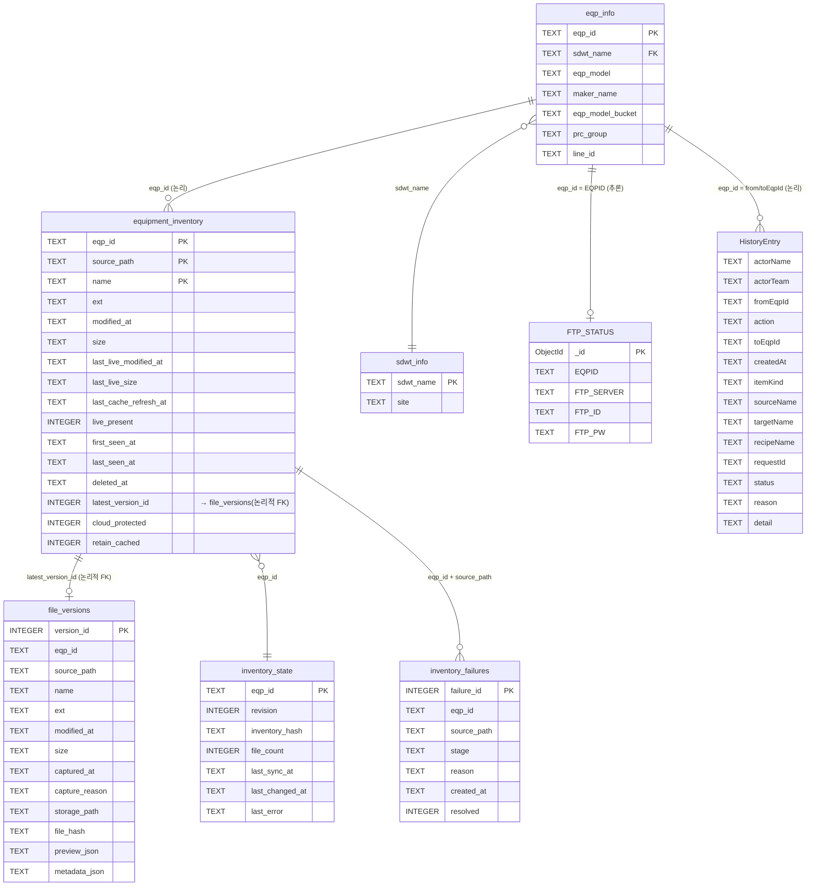

# ERD — Recipe Management System (RMS)

> 기준일: 2026-05-17  
> 기준: `/home/dev/project/recipe` 실제 소스코드  
> 추론 원칙: 코드에서 확인 불가한 내용은 **"추론"** 또는 **"확인 필요"** 로 표기.

---

## 1. ERD 문서 개요

이 문서는 RMS 코드베이스에서 사용하는 모든 저장소(DB, 파일, FTP)의 스키마, 관계, 데이터 흐름을 정리한다.

| 저장소 | 종류 | 위치 | 역할 |
|--------|------|------|------|
| **SQLite** (`recipe_cache.sqlite3`) | 로컬 캐시 DB | `{tempdir}/recipe_test_edit/recipe_cache/` | 인벤토리·버전·실패·상태 캐시 |
| **PostgreSQL** (`shared_db`) | 사내 DB (읽기 전용) | `.env`의 `POSTGRES_URL`로 관리 | 설비 마스터 |
| **MongoDB** (`ADDCMP`) | 사내 DB (읽기 전용) | `.env`의 `MONGO_URL`로 관리 | FTP 인증 정보 |
| **FTP** (설비별) | 사내 설비 파일서버 | 설비 IP:21 | Recipe 파일 실제 저장소 |
| **JSONL** (`recipe_action_history.jsonl`) | 로컬 Append-only 로그 | `{tempdir}/recipe_test_edit/history/` | 작업 이력 |
| **VM 파일스토어** | 로컬 파일시스템 | `{tempdir}/recipe_test_edit/recipe_vm_store/` | 바이너리 캐시 + 메타 JSON |
| **Shadow 파일** | 로컬 파일시스템 | `{tempdir}/recipe_test_edit/` | 삭제·이름변경 전 백업 |
| **CSV** (`cloud_protected_files.csv`) | 정적 파일 | `backend/app/data/` | 클라우드 보호 파일 목록 |

---

## 2. 데이터베이스 사용 방식

```
┌──────────────────────────────────────────────────────┐
│                    FastAPI 백엔드                     │
│                                                      │
│  [API 요청 처리]            [백그라운드 워커]         │
│   ↓ 읽기 전용                ↓ 읽기 전용             │
│  PostgreSQL (설비 목록)    PostgreSQL (lk_model 설비) │
│  MongoDB (FTP 인증)        MongoDB (FTP 인증)         │
│   ↓ 실시간 읽기/쓰기         ↓ 실시간 읽기           │
│  설비 FTP                  설비 FTP (목록 + 다운로드) │
│   ↓ 캐시 fallback            ↓ 캐시 저장             │
│  SQLite (file_versions)    SQLite (4개 테이블 전체)  │
│                            VM 파일스토어              │
│   ↓ 이력 기록               ─                        │
│  JSONL 로그                                          │
└──────────────────────────────────────────────────────┘
```

- **PostgreSQL / MongoDB**: 사내망 전용. 읽기만 수행. 직접 INSERT/UPDATE 없음.
- **SQLite**: 로컬 캐시. API와 워커가 동시 접근. 명시적 트랜잭션 없음 (커넥션별 개별 commit).
- **FTP**: 모든 실제 파일 저장소. 쓰기 작업(persist/rename/delete/transfer)은 FTP에 직접 반영.
- **JSONL**: Append-only. 읽기 시 전체 파일 스캔 후 메모리 정렬.

---

## 3. 주요 테이블/모델 목록

| # | 이름 | DB 종류 | 소스 파일 | 읽기 주체 | 쓰기 주체 |
|---|------|---------|-----------|-----------|-----------|
| 1 | `equipment_inventory` | SQLite | `recipe_cache_store.py` | 워커, API | 워커 |
| 2 | `file_versions` | SQLite | `recipe_cache_store.py` | API (fallback) | 워커 |
| 3 | `inventory_failures` | SQLite | `recipe_cache_store.py` | API | 워커 |
| 4 | `inventory_state` | SQLite | `recipe_cache_store.py` | API | 워커 |
| 5 | `public.eqp_info` | PostgreSQL | `recipe_test_impl.py`, `ftp_eqp_ip.py` | API, 워커 | — |
| 6 | `public.sdwt_info` | PostgreSQL | `recipe_test_impl.py`, `ftp_eqp_ip.py` | API, 워커 | — |
| 7 | `core.recipe_unit` | PostgreSQL | `main.py` | (레거시 API) | — |
| 8 | `ADDCMP.FTP_STATUS` | MongoDB | `ftp_credentials.py`, `ftp_eqp_ip.py` | API, 워커 | — |
| 9 | `HistoryEntry` (JSONL) | 로컬 파일 | `history_service.py` | API | API |
| 10 | VM 메타 JSON | 파일시스템 | `recipe_vm_store.py` | 워커 | 워커 |
| 11 | `cloud_protected_files.csv` | CSV | `cloud_protected_registry.py` | API, 워커 | RMS 스크립트 |

---

## 4. 테이블별 컬럼 상세

### 4.1 `equipment_inventory` (SQLite)

> 소스: `backend/app/services/recipe_cache_store.py`

복합 PK: `(eqp_id, source_path, name)`

| 컬럼명 | 타입 | PK | Nullable | Default | 비고 |
|--------|------|----|----------|---------|------|
| `eqp_id` | TEXT | ✓ (복합) | NOT NULL | — | 설비 ID |
| `source_path` | TEXT | ✓ (복합) | NOT NULL | — | 소문자 정규화 저장 (`_norm_path()`) |
| `name` | TEXT | ✓ (복합) | NOT NULL | — | 파일명 |
| `ext` | TEXT | — | NULL 허용 | — | 파일 확장자 |
| `modified_at` | TEXT | — | NULL 허용 | — | 마지막 캐시 기준 수정일시 |
| `size` | TEXT | — | NULL 허용 | — | 파일 크기 (문자열) |
| `last_live_modified_at` | TEXT | — | NULL 허용 | — | 마지막 FTP 라이브 수정일시 (**ALTER로 추가**) |
| `last_live_size` | TEXT | — | NULL 허용 | — | 마지막 FTP 라이브 크기 (**ALTER로 추가**) |
| `last_cache_refresh_at` | TEXT | — | NULL 허용 | — | 마지막 캐시 갱신 일시 (**ALTER로 추가**) |
| `live_present` | INTEGER | — | NOT NULL | `1` | FTP에 현재 존재 여부 (0/1) |
| `first_seen_at` | TEXT | — | NOT NULL | — | 최초 발견 일시 |
| `last_seen_at` | TEXT | — | NOT NULL | — | 마지막 확인 일시 |
| `deleted_at` | TEXT | — | NULL 허용 | — | FTP에서 삭제 감지 일시 |
| `latest_version_id` | INTEGER | — | NULL 허용 | — | → `file_versions.version_id` (논리적 FK, 제약 없음) |
| `cloud_protected` | INTEGER | — | NOT NULL | `0` | 클라우드 보호 파일 여부 (**ALTER로 추가**) |
| `retain_cached` | INTEGER | — | NOT NULL | `0` | 캐시 강제 유지 여부 (**ALTER로 추가**) |

**인덱스**: `idx_inventory_eqp_path ON (eqp_id, source_path)`

---

### 4.2 `file_versions` (SQLite)

> 소스: `backend/app/services/recipe_cache_store.py`

PK: `version_id` (AUTOINCREMENT)

| 컬럼명 | 타입 | PK | Nullable | Default | 비고 |
|--------|------|----|----------|---------|------|
| `version_id` | INTEGER | ✓ | NOT NULL | AUTOINCREMENT | |
| `eqp_id` | TEXT | — | NOT NULL | — | |
| `source_path` | TEXT | — | NOT NULL | — | 소문자 정규화 저장 |
| `name` | TEXT | — | NOT NULL | — | 파일명 |
| `ext` | TEXT | — | NULL 허용 | — | |
| `modified_at` | TEXT | — | NULL 허용 | — | |
| `size` | TEXT | — | NULL 허용 | — | |
| `captured_at` | TEXT | — | NOT NULL | — | 캐시 캡처 일시 |
| `capture_reason` | TEXT | — | NOT NULL | — | `'worker'` 등 |
| `storage_path` | TEXT | — | NOT NULL | — | 로컬 raw 바이너리 파일 경로 |
| `file_hash` | TEXT | — | NOT NULL | — | SHA-1 해시 |
| `preview_json` | TEXT | — | NULL 허용 | — | JSON 직렬화된 미리보기 dict |
| `metadata_json` | TEXT | — | NULL 허용 | — | JSON 직렬화된 메타 dict |

**인덱스**: `idx_versions_lookup ON (eqp_id, source_path, name, modified_at)`

---

### 4.3 `inventory_failures` (SQLite)

> 소스: `backend/app/services/recipe_cache_store.py`

PK: `failure_id` (AUTOINCREMENT)

| 컬럼명 | 타입 | PK | Nullable | Default | 비고 |
|--------|------|----|----------|---------|------|
| `failure_id` | INTEGER | ✓ | NOT NULL | AUTOINCREMENT | |
| `eqp_id` | TEXT | — | NOT NULL | — | |
| `source_path` | TEXT | — | NULL 허용 | — | |
| `stage` | TEXT | — | NOT NULL | — | `'inventory'` 등 |
| `reason` | TEXT | — | NOT NULL | — | 오류 메시지 |
| `created_at` | TEXT | — | NOT NULL | — | |
| `resolved` | INTEGER | — | NOT NULL | `0` | 해결 여부 (0/1) |

**인덱스**: `idx_failures_eqp ON (eqp_id, resolved, created_at)`

---

### 4.4 `inventory_state` (SQLite)

> 소스: `backend/app/services/recipe_cache_store.py`

PK: `eqp_id`

| 컬럼명 | 타입 | PK | Nullable | Default | 비고 |
|--------|------|----|----------|---------|------|
| `eqp_id` | TEXT | ✓ | NOT NULL | — | |
| `revision` | INTEGER | — | NOT NULL | `0` | 변경 감지 시 +1 |
| `inventory_hash` | TEXT | — | NOT NULL | `''` | SHA-1 스냅샷 해시 |
| `file_count` | INTEGER | — | NOT NULL | `0` | 현재 파일 수 |
| `last_sync_at` | TEXT | — | NULL 허용 | — | 마지막 동기화 일시 |
| `last_changed_at` | TEXT | — | NULL 허용 | — | 마지막 변경 감지 일시 |
| `last_error` | TEXT | — | NULL 허용 | — | 마지막 오류 메시지 |

---

### 4.5 `public.eqp_info` (PostgreSQL — 쿼리 기반 **추론**)

> 소스: `recipe_test_impl.py:load_eqp_master_options()`, `ftp_eqp_ip.py:load_lk_model_eqps()`

| 컬럼명 | 비고 |
|--------|------|
| `eqp_id` | PK 추론. SELECT·WHERE·JOIN 키로 사용 |
| `sdwt_name` | FK → `sdwt_info.sdwt_name` (JOIN 키) |
| `eqp_model` | SELECT |
| `maker_name` | SELECT |
| `eqp_model_bucket` | 신버전 컬럼명 (확인됨) |
| `eqp_model_bucker` | **오타 변형** — 구버전 컬럼명 추론. 코드에서 4개 쿼리 폴백으로 양쪽 시도 |
| `prc_group` | `WHERE prc_group IS NOT NULL` 필터 |
| `line_id` | `COALESCE(e.line_id::text, '')` — `sdwt_info.site` 없을 때 fallback |

---

### 4.6 `public.sdwt_info` (PostgreSQL — 쿼리 기반 **추론**)

> 소스: `recipe_test_impl.py`, `ftp_eqp_ip.py`

| 컬럼명 | 비고 |
|--------|------|
| `sdwt_name` | PK 추론. JOIN 키 |
| `site` | `COALESCE(s.site, '')` → line 값으로 사용 |

---

### 4.7 `core.recipe_unit` (PostgreSQL — **확인 필요**)

> 소스: `backend/app/main.py` `GET /api/recipe-units` 레거시 엔드포인트 SELECT 절 기반

| 컬럼명 | 비고 |
|--------|------|
| `id` | PK 추론 |
| `line_name` | |
| `team_name` | |
| `equipment_id` | ILIKE 필터 |
| `ppid` | ILIKE 필터 |
| `cas_name` | |
| `job_name` | |
| `unit_recipe_name` | |
| `ftp_path` | |
| `is_active` | |
| `created_at` | |

> **확인 필요**: 테이블 실제 존재 여부 및 현재 사용 여부 불명확. 레거시 엔드포인트로 추정.

---

### 4.8 `ADDCMP.FTP_STATUS` (MongoDB — projection 기반 **추론**)

> 소스: `backend/app/services/ftp_credentials.py`, `ftp_eqp_ip.py`

| 필드명 | 비고 |
|--------|------|
| `_id` | MongoDB ObjectId. 쿼리에서 명시 제외 (`'_id': 0`) |
| `EQPID` | 조회 키 (`find_one` 필터) |
| `FTP_SERVER` | FTP 호스트 IP |
| `FTP_ID` | FTP 사용자명 |
| `FTP_PW` | FTP 비밀번호 |

> projection `{'_id': 0, 'FTP_SERVER': 1, 'FTP_ID': 1, 'FTP_PW': 1}` 으로 명시. 추가 필드 존재 가능.

---

### 4.9 `HistoryEntry` — JSONL 필드

> 소스: `backend/app/services/history_service.py`  
> 경로: `{tempdir}/recipe_test_edit/history/recipe_action_history.jsonl`

| 필드명 | 타입 | Default | 비고 |
|--------|------|---------|------|
| `actorName` | str | `'Unknown'` | 작업자 이름 (프론트 입력값, 서버 검증 없음) |
| `actorTeam` | str | `''` | 작업자 팀 |
| `fromEqpId` | str | (필수) | 작업 출발 설비 |
| `action` | str | (필수) | `transfer`, `rename`, `delete`, `persist_cas`, `persist_job`, `clone` 등 |
| `toEqpId` | str | (필수) | 작업 대상 설비 |
| `createdAt` | str | 현재 시각 | `'YYYY-MM-DD HH:MM:SS'` |
| `itemKind` | str | `''` | `'cas'`, `'job'`, `'recipe'` |
| `sourceName` | str | `''` | 원본 파일명 |
| `targetName` | str | `''` | 대상 파일명 |
| `recipeName` | str | `''` | 연관 레시피명 |
| `requestId` | str | `''` | 요청 식별자 |
| `status` | str | `'ok'` | `'ok'`, `'failed'` 등 |
| `reason` | str | `''` | 실패 사유 |
| `detail` | str | `''` | 상세 설명 |

---

### 4.10 VM 스토어 메타 JSON 필드

> 소스: `backend/app/services/recipe_vm_store.py`  
> 경로: `{tempdir}/recipe_test_edit/recipe_vm_store/{eqp_id}/{source_path_parts}/{file_name}.meta.json`

| 필드명 | 타입 | 비고 |
|--------|------|------|
| `eqpId` | str | |
| `sourcePath` | str | |
| `name` | str | 파일명 |
| `modifiedAt` | str | |
| `size` | str | |
| `sourceKind` | str | |
| `cloudProtected` | bool | |
| `capturedAt` | str | `'YYYY-MM-DD HH:MM:SS'` |
| *(동적 필드)* | any | `save_vm_file(metadata=…)` 으로 `meta.update()` — **확인 필요** |

---

### 4.11 `cloud_protected_files.csv`

> 소스: `backend/app/services/cloud_protected_registry.py`  
> 경로: `backend/app/data/cloud_protected_files.csv`

| 컬럼명 | 비고 |
|--------|------|
| `rcp_id` | 보호 대상 파일명. 소문자 비교. `.dypr` → `.drpr` 정규화 적용 |

> `csv.DictReader` + `utf-8-sig` (BOM 처리). 추가 컬럼 존재 가능하나 코드에서 미사용.

---

## 5. 테이블 간 관계와 Cardinality

### 5.1 SQLite 내부 관계

| 관계 | Cardinality | 비고 |
|------|-------------|------|
| `equipment_inventory` → `file_versions` | N:1 (latest) | `latest_version_id` → `version_id`. **논리적 FK, DB 제약 없음** |
| `equipment_inventory` → `inventory_state` | N:1 | `eqp_id` 동일. **명시적 FK 없음** |
| `equipment_inventory` → `inventory_failures` | N:N (논리) | `eqp_id` + `source_path` 동일. 실패 이력 다수 가능 |
| `file_versions` → `equipment_inventory` | N:1 | `(eqp_id, source_path, name)` 동일 |

### 5.2 외부 DB 간 논리 관계

| 관계 | Cardinality | DB 경계 | 비고 |
|------|-------------|---------|------|
| `eqp_info.sdwt_name` → `sdwt_info.sdwt_name` | N:1 | PG 내부 | JOIN 쿼리로 확인 |
| `eqp_info.eqp_id` → `FTP_STATUS.EQPID` | 1:1 (**추론**) | PG → MongoDB | `load_eqp_ip(eqp_id)` 호출 패턴 기반 추론 |
| `eqp_info.eqp_id` → `equipment_inventory.eqp_id` | 1:N | PG → SQLite | 논리적 연결, DB 제약 없음 |
| `eqp_info.eqp_id` → `HistoryEntry.fromEqpId/toEqpId` | 1:N | PG → JSONL | 논리적 연결 |

---

## 6. API와 테이블 간 매핑

> 소스: `recipe_test_eqp.py`, `recipe_test_content.py`, `recipe_test_history.py`, `recipe_test_ops.py`, `recipe_inventory.py`

| 메서드 | 경로 | Read | Write |
|--------|------|------|-------|
| GET | `/api/recipe-test/eqp-options` | PG `eqp_info`, `sdwt_info` | — |
| POST | `/api/recipe-test/load` | PG `eqp_info`, MongoDB `FTP_STATUS`, FTP, SQLite `equipment_inventory` | — |
| GET | `/api/recipe-test/cas-content` | FTP (`.cas`), 인메모리 `CAS_CACHE` | — |
| GET | `/api/recipe-test/job-content` | FTP (`.job`), 인메모리 `JOB_CACHE` | — |
| GET | `/api/recipe-test/recipe-content` | MongoDB `FTP_STATUS`, FTP, SQLite `file_versions` (fallback) | — |
| GET | `/api/recipe-test/recipe-source-list` | MongoDB `FTP_STATUS`, FTP, SQLite `equipment_inventory` + `file_versions` | — |
| GET | `/api/recipe-test/history` | JSONL `recipe_action_history.jsonl` | — |
| POST | `/api/recipe-test/cas/save` | — | 인메모리 `CAS_CACHE` |
| POST | `/api/recipe-test/cas/persist` | MongoDB `FTP_STATUS`, FTP, 인메모리 `CAS_CACHE` | FTP, JSONL |
| POST | `/api/recipe-test/job/save` | — | 인메모리 `JOB_CACHE` |
| POST | `/api/recipe-test/job/persist` | MongoDB `FTP_STATUS`, FTP, 인메모리 `JOB_CACHE` | FTP, JSONL |
| POST | `/api/recipe-test/recipe/clone` | MongoDB `FTP_STATUS`, FTP | FTP, JSONL |
| POST | `/api/recipe-test/file/rename` | MongoDB `FTP_STATUS`, FTP | FTP, Shadow 파일, JSONL |
| POST | `/api/recipe-test/file/delete` | MongoDB `FTP_STATUS` | FTP, Shadow 파일, JSONL |
| POST | `/api/recipe-test/transfer` | MongoDB `FTP_STATUS`, FTP (source) | FTP (target 설비들), JSONL |
| GET | `/api/recipe-inventory/entries` | SQLite `equipment_inventory` | — |
| GET | `/api/recipe-inventory/failures` | SQLite `inventory_failures` | — |
| GET | `/api/recipe-inventory/latest-version` | SQLite `file_versions` | — |
| GET | `/api/recipe-inventory/state` | SQLite `inventory_state` | — |

---

## 7. Frontend 화면과 데이터 흐름

> 소스: `frontend/src/features/recipe_test/api/recipeTestApi.ts`, `RecipeTestPage.vue`, `MyHistoryPage.vue`

### 7.1 RecipeTestPage (`/recipe-test`)

```
화면 진입
  └─ [자동] GET /api/recipe-test/eqp-options
       └─ PG eqp_info + sdwt_info → Line/Team/EqpId 드롭다운 채움

[Load 버튼 클릭]
  └─ POST /api/recipe-test/load {line, team, eqpId}
       ├─ PG: 설비 모델·제조사 정보 조회
       ├─ MongoDB: FTP 인증 조회
       ├─ FTP: CAS 파일 목록 (LIST)
       ├─ FTP: JOB 파일 목록 (LIST)
       └─ SQLite: equipment_inventory (캐시 보조)
       → casList, jobList, recipeList 프론트 상태에 저장

[CAS 파일 클릭]
  └─ GET /api/recipe-test/cas-content?eqpId=X&casId=Y
       ├─ 인메모리 CAS_CACHE 확인 (hit → 즉시 반환)
       └─ FTP: RETR {cas_file} → parse_cas_slots() → 슬롯 테이블 렌더

[JOB 클릭]
  └─ GET /api/recipe-test/job-content?eqpId=X&jobId=Y
       ├─ 인메모리 JOB_CACHE 확인
       └─ FTP: RETR {job_file} → parse_job_text() → Polisher/Cleaner 구조 렌더

[레시피 이름 클릭]
  └─ GET /api/recipe-test/recipe-content?eqpId=X&recipeId=RCP_SRC::sourceKind::name
       ├─ MongoDB: FTP 인증
       ├─ FTP: RETR {recipe_file} → pol_con_decoder / text_parser → preview 렌더
       └─ FTP 실패 시: SQLite file_versions → preview_json fallback

[편집 모드 → Save]
  └─ POST /api/recipe-test/cas/save 또는 job/save (인메모리 캐시에만 저장)

[편집 모드 → Persist]
  └─ POST /api/recipe-test/cas/persist 또는 job/persist
       ├─ 인메모리 캐시 → FTP: STOR
       └─ JSONL: append_history_entry()

[Transfer Cart → Move]
  └─ POST /api/recipe-test/transfer
       ├─ FTP: RETR (source 설비)
       ├─ FTP: STOR × N (target 설비들)
       └─ JSONL: 항목당 이력 append
```

### 7.2 MyHistoryPage (`/history`)

```
화면 진입
  └─ GET /api/recipe-test/history?limit=500
       └─ JSONL 전체 읽기 → 최신순 정렬 → 최대 500건 반환 → 테이블 렌더
```

---

## 8. 파일/FTP/외부 데이터와 DB 저장 흐름

### 8.1 백그라운드 워커 전체 흐름

> 소스: `backend/tools/recipe_inventory_worker.py`, `backend/app/services/recipe_inventory_sync.py`

```
[매 cycle 시작] (기본 --interval-sec=5)
  │
  ▼ 1. PostgreSQL
  load_lk_model_eqps()
  └─ eqp_info INNER JOIN sdwt_info
     WHERE prc_group IS NOT NULL AND eqp_model_bucket='lk_model'
  → [eqpId, ...] 리스트

  │
  ▼ 2. ThreadPoolExecutor (--concurrency=10)
  ─────────── 설비당 병렬 실행 ───────────
  │
  ▼ 3. MongoDB
  load_eqp_ftp_credentials(eqp_id)
  └─ ADDCMP.FTP_STATUS.find_one({EQPID: eqp_id})
  → {host, user, password}

  │
  ▼ 4. sync_equipment_inventory_once(eqp_id, ftp_ip, ...)
     각 MONITORED_SOURCE_CONFIG 경로(8가지) 순회:

     4a. FTP LIST (인메모리 TTL 캐시 3초)
     _list_live_entries_cached() → 파일명·수정일시·크기

     4b. SQLite equipment_inventory
     reconcile_inventory_entries()
     ├─ 신규/변경: INSERT OR REPLACE
     └─ 사라진 파일: UPDATE live_present=0, deleted_at=NOW

     4c. 파일 변경 감지
     _needs_refresh_from_live()
     └─ VM 메타 JSON vs FTP 수정일시·크기 비교
     └─ 다르면 → 5 실행

  │
  ▼ 5. cache_recipe_file_from_live()
     5a. FTP: RETR → bytes
     5b. build_recipe_preview_from_bytes() → preview dict
     5c. save_vm_file()
         └─ VM 파일스토어: bytes 저장 + .meta.json 저장
     5d. store_file_version()
         ├─ raw bytes → recipe_cache/raw/{eqp_id}/{hash12}/{stamp_hash.ext.bin}
         ├─ SQLite file_versions: INSERT
         └─ SQLite equipment_inventory: latest_version_id 갱신

  │
  ▼ 6. 실패 처리
  mark_inventory_failure()
  └─ SQLite inventory_failures: INSERT

  │
  ▼ 7. 상태 갱신
  touch_inventory_state()
  └─ SQLite inventory_state: UPSERT
     └─ hash 변경 또는 file_count 변경 시 revision +1
```

### 8.2 RMS 클라우드 보호 목록 갱신 흐름

> 소스: `backend/app/RMS/RMS_down.py`, `run_RMS.sh`

```
[수동 실행 — 확인 필요: 자동 스케줄 여부]
  │
  ▼ bigdataquery.getData()  (사내 전용 라이브러리)
  └─ ees_ds_eai.rms_rcp_mst_rms 테이블
     WHERE ext IN (pol, con, meg, br, drpr)
       AND rcp_id NOT LIKE 'TT%' AND NOT LIKE 'RW%'
       AND impala_insert_time = 오늘
       AND line NOT IN ('A1','A2','B1','AB',...)
  → DISTINCT rcp_id 목록

  │
  ▼ DataFrame 병합 → CSV 저장
  └─ backend/app/data/cloud_protected_files.csv

  │  [런타임 — API/워커 요청 시]
  ▼ load_cloud_protected_recipe_ids()
  └─ CSV 읽기 (mtime 변경 시만 재로드, 인메모리 캐시)
  → is_cloud_protected_file(name) → bool
```

---

## 9. Mermaid ERD 다이어그램



---

## 10. 확인 필요 관계

| # | 항목 | 근거 | 상태 |
|---|------|------|------|
| 1 | `equipment_inventory.latest_version_id` → `file_versions.version_id` | 컬럼 존재 + `store_file_version()`에서 갱신. 단 SQLite FK 제약 없음 | **논리적 FK 확인, 제약 없음** |
| 2 | `eqp_info.eqp_id` = `FTP_STATUS.EQPID` | `load_eqp_ip(eqp_id)` 호출 시 MongoDB에서 `EQPID`로 조회 | **추론 — 1:1 보장 여부 확인 필요** |
| 3 | `eqp_info.eqp_model_bucker` vs `eqp_model_bucket` | 4개 쿼리 폴백 구조로 두 컬럼명 모두 시도 | **구버전 DB 오타 컬럼 여부 확인 필요** |
| 4 | `core.recipe_unit` 테이블 존재 여부 | `main.py` SELECT 기반 — 현재 메인 라우터에서 미사용 | **실제 테이블 존재 확인 필요** |
| 5 | `recipe_history.sqlite3` (`backend/app/data/`) 용도 | 파일은 존재하나 코드에서 이 경로 참조 없음 | **레거시 여부 확인 필요** |
| 6 | `HistoryEntry.actorName` 신뢰도 | 서버 측 인증 없이 프론트가 넘긴 값 그대로 기록 | **보안 이슈 — 위조 가능** |
| 7 | `inventory_failures.resolved` 자동 해제 시점 | `resolve_inventory_failures()`가 `reconcile_inventory_entries()` 성공 시 호출됨 | **UI에서 수동 해제 불가 여부 확인 필요** |
| 8 | VM 메타 JSON 동적 필드 목록 | `save_vm_file(metadata=…)` 으로 `meta.update()` — 런타임에 필드 추가 가능 | **실제 저장 필드 목록 확인 필요** |
| 9 | `RMS_down.py` 실행 주기 | `run_RMS.sh` 존재하나 cron 설정 여부 미확인 | **자동 스케줄 여부 확인 필요** |

---

## 11. DB 설계상 문제점

### 11.1 SQLite

| 문제 | 위치 | 영향 |
|------|------|------|
| **FK 제약 없음** | `equipment_inventory.latest_version_id` → `file_versions` | 버전 삭제 시 참조 무결성 깨짐 가능 |
| **모든 날짜·크기를 TEXT로 저장** | 전 테이블 `modified_at`, `size`, `created_at` 등 | 범위 쿼리·정렬 시 문자열 비교 → 포맷 혼재 시 오작동 가능 |
| **영속 경로 미보장** | `tempdir` 하위 저장 (`temp_file_store.py:LOCAL_EDIT_BASE`) | OS 재부팅·tmpfs 교체 시 캐시 전체 소실 |
| **명시적 트랜잭션 없음** | `reconcile_inventory_entries()`, `store_file_version()` 별도 커넥션 | 워커 중단 시 partial write 가능 |
| **스키마 버전 관리 없음** | `ensure_schema()` + ALTER 패치 방식 | 컬럼 삭제·타입 변경·인덱스 변경 불가 |
| **JSONL 이력 파일 무한 증가** | `history_service.py:list_history_entries()` 전체 스캔 | 파일 크기 증가 시 읽기 성능 저하 |
| **인메모리 캐시 TTL 없음** | `BOOTSTRAP_CACHE`, `CAS_CACHE`, `JOB_CACHE` 등 | 설비 데이터 변경 시 무효화 불가, 멀티프로세스 비공유 |

### 11.2 PostgreSQL / MongoDB

| 문제 | 위치 | 영향 |
|------|------|------|
| **컬럼명 오타 폴백 4회 시도** | `load_eqp_master_options()` 내 4개 쿼리 순차 실행 | 매 `eqp-options` 요청마다 최대 4회 DB 쿼리 |
| **MongoDB 커넥션 풀 없음** | `ftp_credentials.py:load_eqp_ip()` | 요청마다 `MongoClient()` 생성·해제 — 오버헤드 |
| **SQLAlchemy Engine 매 호출 생성** | `recipe_test_impl.py:load_eqp_master_options()` | 요청마다 `create_engine()` — 커넥션 풀 재초기화 |

---

## 12. 인덱스 / 정규화 / 트랜잭션 개선 제안

### 12.1 인덱스 개선

| 테이블 | 현재 인덱스 | 추가 제안 | 이유 |
|--------|------------|-----------|------|
| `file_versions` | `(eqp_id, source_path, name, modified_at)` | `(eqp_id, source_path, name, version_id DESC)` | 최신 버전 조회(`ORDER BY version_id DESC LIMIT 1`) 패턴에 최적화 |
| `equipment_inventory` | PK + `(eqp_id, source_path)` | `(eqp_id, live_present)` 추가 | 라이브 파일만 필터 조회 빈도 높음 |
| `inventory_failures` | `(eqp_id, resolved, created_at)` | 현행 유지 | 현재 쿼리 패턴(`WHERE resolved=0 ORDER BY created_at DESC`)에 적합 |

### 12.2 날짜 타입 정규화

```sql
-- 현재: TEXT ("26-04-28 08:15AM" 형식 혼재 가능)
modified_at TEXT

-- 개선안 A: ISO 8601 강제 정규화 (YYYY-MM-DD HH:MM:SS) — 현재 코드와 호환
-- 개선안 B: REAL (Unix timestamp) — 범위 쿼리·정렬 성능 향상
-- SQLite의 strftime() 활용 또는 Python 레이어에서 정규화
```

### 12.3 트랜잭션 원자성 개선

```python
# 현재: store_file_version()과 touch_inventory_state()가 별도 커넥션 → 원자성 없음
# 워커 중단 시 file_versions에 INSERT됐으나 inventory_state 미갱신 상태 가능

# 개선: WAL 모드 활성화 (동시 읽기 성능) + 단일 커넥션으로 묶기
conn.execute("PRAGMA journal_mode=WAL")
```

### 12.4 커넥션 풀링 개선

```python
# 현재: 요청마다 MongoClient() 생성
client = MongoClient(MONGO_URL, serverSelectionTimeoutMS=3000)

# 개선: FastAPI lifespan으로 앱 시작 시 싱글턴 클라이언트 관리
# create_engine()도 모듈 수준 싱글턴으로 이동 (SQLAlchemy 커넥션 풀 활용)
_engine = create_engine(POSTGRES_URL, pool_size=5, max_overflow=2)
```

### 12.5 JSONL → SQLite 이관 검토

```
현재: recipe_action_history.jsonl (append-only, 전체 파일 읽기)
개선: SQLite 별도 테이블로 이관

장점:
  - 인덱스 기반 필터링 (actorTeam, action, fromEqpId, createdAt 범위)
  - LIMIT/OFFSET 페이지네이션 지원
  - 파일 크기 무한 증가 문제 해소
  - 기존 recipe_cache.sqlite3에 통합 가능
```

### 12.6 스키마 마이그레이션 도입

```
현재: ensure_schema()에서 PRAGMA table_info로 컬럼 존재 확인 후 ALTER
  → 컬럼 삭제·타입 변경·인덱스 변경 대응 불가

개선: version 테이블 도입 또는 Alembic 적용
  CREATE TABLE schema_version (version INTEGER PRIMARY KEY);
  → 앱 시작 시 현재 버전 확인 후 순차 마이그레이션 실행
```
