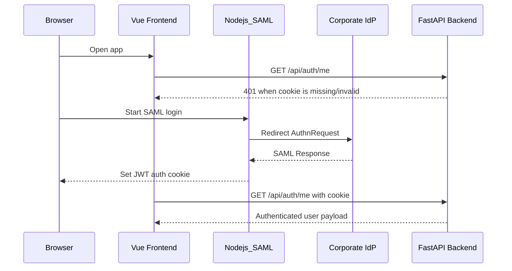

# SAML 인증 연동 문서

Last updated: 2026-06-18

## 1. 목적

사내 SAML 인증 흐름과 FastAPI/Vue 연동 기준을 정리한다. 현재 runtime 기준은 SAML JWT cookie이며 fake user fallback은 사용하지 않는다.

## 2. 구성 요소

- `Nodejs_SAML`: SAML login/callback 처리 및 JWT cookie 발급
- `backend/app/routers/auth.py`: FastAPI에서 JWT cookie 검증
- `frontend/src/components/TopBarNav.vue`: 인증 사용자 표시 및 logout
- `backend/app/services/user_profile_service.py`: MongoDB에서 사용자 part/profile 보강

## 3. 필수 env

### Nodejs_SAML

IdP 담당자에게 받은 값을 사용한다.

```env
SAML_ENTRY_POINT=
SAML_ISSUER=
SAML_CALLBACK_URL=
SAML_CERT=
JWT_PRIVATE_KEY_PATH=
AUTH_COOKIE_NAME=auth_token
```

### Backend

```env
AUTH_COOKIE_NAME=auth_token
JWT_CERT_PATH=../Nodejs_SAML/cert/cert.pem
MONGO_URL=mongodb://<host>:<port>/
```

## 4. 인증 흐름

1. 사용자가 웹에 접속한다.
2. 인증 cookie가 없으면 SAML login으로 이동한다.
3. IdP 인증 성공 후 Nodejs_SAML callback이 JWT cookie를 발급한다.
4. Frontend는 `/api/auth/me`로 사용자 정보를 조회한다.
5. Backend는 `AUTH_COOKIE_NAME` cookie를 읽고 `JWT_CERT_PATH`의 public key로 검증한다.
6. Backend API는 request에서 사용자 정보를 추출해 history actor에 사용한다.



## 5. FastAPI 계약

- `GET /api/auth/me`
  - 성공: SAML payload 기반 사용자 정보
  - 실패: 401
- `POST /api/auth/logout`
  - auth cookie 삭제
- `GET /api/user/profile`
  - MongoDB에서 사용자 part/profile 조회

## 6. 검증 항목

- cookie name이 Nodejs_SAML과 backend에서 동일한지 확인
- JWT 서명 private/public key pair 일치 확인
- cookie domain/path/secure/samesite 정책 확인
- 인증 실패 시 fake user로 대체되지 않는지 확인
- My History actorName/knoxid가 SAML payload에서 들어오는지 확인

## 7. 주의사항

- Windows 브라우저에서 접속하더라도 backend 검증은 Ubuntu runtime 기준이다.
- 인증서 경로는 Ubuntu 배포 경로 기준으로 확인한다.
- SAML payload field 이름이 변경되면 `auth.py`의 enrichment 로직도 같이 점검한다.
