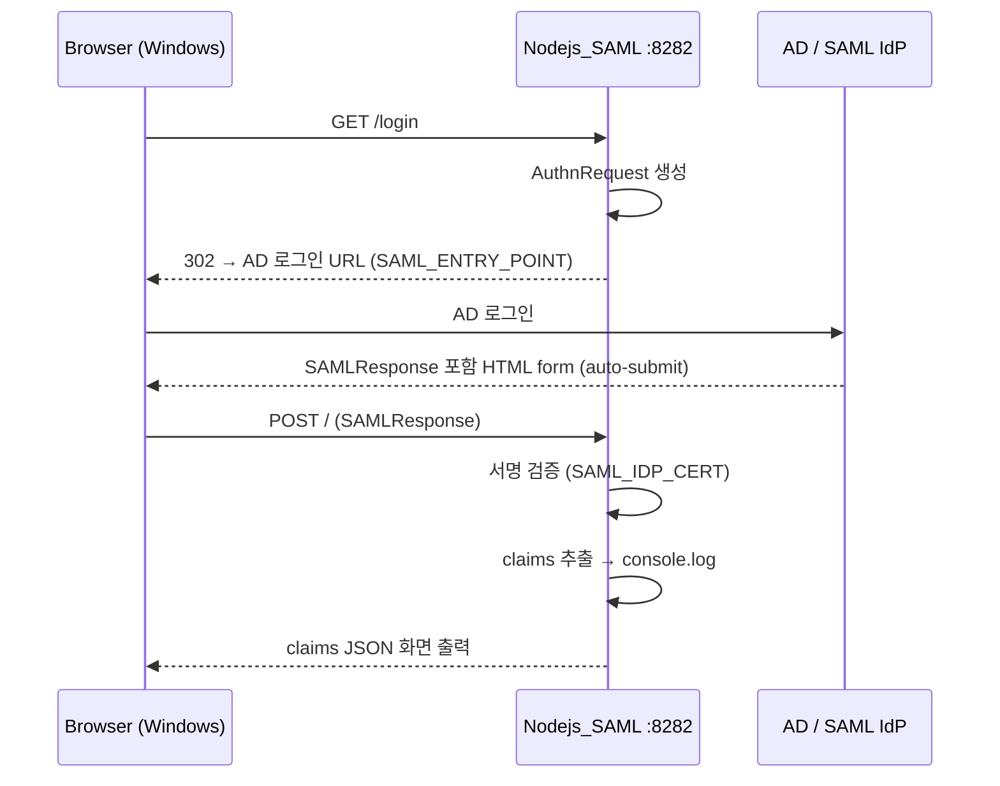

# SAML 인증 구현 설계

## 1. 참고 코드 참고 범위

제공된 참고 코드는 OIDC 방식이다. 실제 구현은 **Node.js + passport-saml** 로 진행한다.
흐름 구조(로그인 진입 → redirect → callback → claims 추출 → 출력)는 동일하게 참고한다.

---

## 2. 제약 조건

AD에 등록된 값 변경 불가:

```
Service URL  : https://10.173.131.184:8282/
Callback URL : https://10.173.131.184:8282/
```

| Method | Path | 역할 |
|--------|------|------|
| GET | `/login` | SAML AuthnRequest 생성 → AD redirect |
| POST | `/` | AD → SAMLResponse 수신 (ACS) |

> `vite preview`(포트 8282) 반드시 종료. Node.js SAML 서버가 8282 단독 점유.

---

## 3. 구현 목표 (1차: 연결 확인)

1. `GET /login` → SAML AuthnRequest 생성 → AD 로그인으로 redirect
2. AD 인증 완료 → `POST /` callback 수신 (SAMLResponse)
3. claims 추출 → `console.log` + 화면에 JSON 출력

세션/쿠키/JWT 발급 없음.

---

## 4. env (`Nodejs_SAML/.env`)

```env
# AD/IdP 연결 (담당자에게 수령)
SAML_ENTRY_POINT=https://ad-idp.example.com/adfs/ls/
SAML_ISSUER=https://10.173.131.184:8282/
SAML_CALLBACK_URL=https://10.173.131.184:8282/

# IdP 서명 인증서 (줄바꿈은 \n 리터럴로 한 줄 저장)
SAML_IDP_CERT="-----BEGIN CERTIFICATE-----\nMIIC...\n-----END CERTIFICATE-----"

# HTTPS 서버 인증서 (https.createServer 전용, SAML Strategy 옵션 아님)
SAML_SSL_KEY_PATH=cert/key.pem
SAML_SSL_CERT_PATH=cert/cert.pem

# 선택 (기본값 사용 가능)
SAML_PORT=8282
SAML_IDENTIFIER_FORMAT=urn:oasis:names:tc:SAML:1.1:nameid-format:unspecified
SAML_SIGNATURE_ALGORITHM=sha256
SAML_ACCEPTED_CLOCK_SKEW_MS=-1
```

> `SAML_IDP_CERT`는 AD/IdP가 SAMLResponse 서명에 사용하는 인증서. SSL 인증서(`cert.pem`)와 별개.

---

## 5. 라우팅 설계

```js
// 로그인 진입
app.get('/login',
  passport.authenticate('saml', { failureRedirect: '/login' })
);

// ACS callback
app.post('/',
  passport.authenticate('saml', { failureRedirect: '/login' }),
  function (req, res) {
    console.log('SAML user:', req.user);
    res.type('html').send(`<pre>${escapeHtml(JSON.stringify(req.user, null, 2))}</pre>`);
  }
);
```

---

## 6. passport-saml 핵심 설정

```js
const strategy = new SamlStrategy({
  entryPoint:               process.env.SAML_ENTRY_POINT,
  issuer:                   process.env.SAML_ISSUER,
  callbackUrl:              process.env.SAML_CALLBACK_URL,
  cert:                     process.env.SAML_IDP_CERT.replace(/\\n/g, '\n'),
  identifierFormat:         process.env.SAML_IDENTIFIER_FORMAT
                              || 'urn:oasis:names:tc:SAML:1.1:nameid-format:unspecified',
  disableRequestedAuthnContext: true,
  signatureAlgorithm:       process.env.SAML_SIGNATURE_ALGORITHM || 'sha256',
  acceptedClockSkewMs:      Number(process.env.SAML_ACCEPTED_CLOCK_SKEW_MS ?? -1),
}, function (profile, done) {
  return done(null, {
    LoginId:    profile['http://schemas.sec.com/2018/05/identity/claims/LoginId'],
    CompId:     profile['http://schemas.sec.com/2018/05/identity/claims/CompId'],
    DeptId:     profile['http://schemas.sec.com/2018/05/identity/claims/DeptId'],
    Sabun:      profile['http://schemas.sec.com/2018/05/identity/claims/Sabun'],
    Mail:       profile['http://schemas.sec.com/2018/05/identity/claims/Mail'],
    UserId:     profile['http://schemas.sec.com/2018/05/identity/claims/UserId'],
    DeptName:   profile['http://schemas.sec.com/2018/05/identity/claims/DeptName'],
    GrdName:    profile['http://schemas.sec.com/2018/05/identity/claims/GrdName'],
    Username:   profile['http://schemas.sec.com/2018/05/identity/claims/Username'],
    rawProfile: profile,  // claim mapping 확인용, 연결 완료 후 제거
  });
});
```

---

## 7. 흐름도



---

## 8. 확인 사항

- `POST /` 라우터를 static 서빙보다 먼저 등록
- AD가 HTTP-POST Binding으로 callback 보내는지 확인
- `SAML_IDP_CERT`는 env에서 `\n` 리터럴로 저장 → 코드에서 `.replace(/\\n/g, '\n')` 적용
- `failureRedirect: '/login'` 으로 설정 (무한루프 방지)
