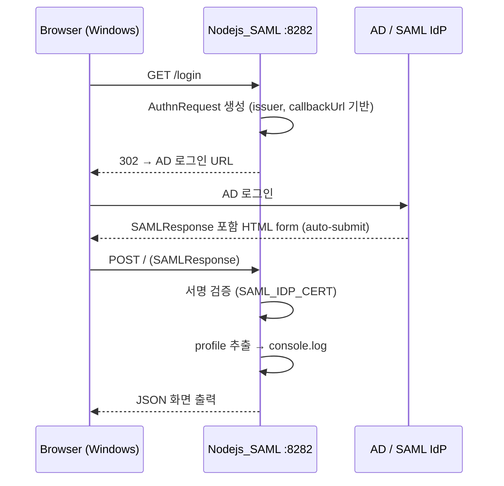

# SAML 인증 흐름

## env 필수값

| 변수 | 설명 |
|------|------|
| `SAML_ENTRY_POINT` | AD 로그인 URL |
| `SAML_ISSUER` | AD에 등록된 Entity ID (`https://10.173.131.184:8282/`) |
| `SAML_CALLBACK_URL` | ACS URL (`https://10.173.131.184:8282/`) |
| `SAML_IDP_CERT` | AD 서명 인증서 (줄바꿈 `\n`으로 한 줄 저장) |
